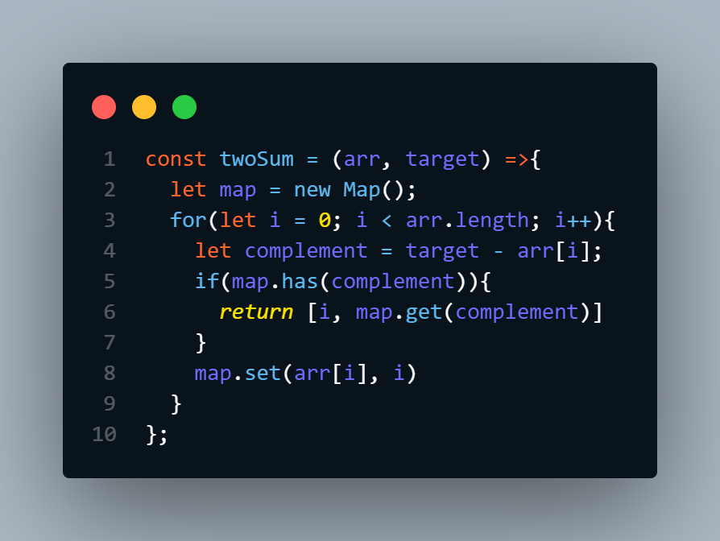

# Two Sum 
Neste desafio do LeetCode, o objetivo é encontrar em dois números em nossa matriz que a soma seja igual o valor específico (target).

Objetivo é que o tempo de execução seja linear O(n):
  - Exemplo: 
    - arr = [2, 7, 11, 15] target = 9
    - output = [0,1] //2+7 = 9

## Principal ideia de resolução
  - A ideia foi baseada em uma operação básica matemática 
  ```( x (complemento) = num1(target) - num2(indice atual do loop)``` onde dentro do Loop "for" armazenamos o número que a soma com o num2 seria = target. 
  Assim, interamos o loop até encontrar o indice cujo o valor seja igual ao complemento. 
  Por fim, adicionamos esse índice a um novo array para retornar o resultado.
  </br>
  

## Outros modos de resolver 
  ````
    var twoSum2 = function(nums, target) {

      const complimentToIndexMap = {}

      for(i=0; i < nums.length; i++) {
          const num = nums[i]
          const compliment = target - num

          if(complimentToIndexMap.hasOwnProperty(compliment)) {
              return [complimentToIndexMap[compliment], i]
          }

          complimentToIndexMap[num] = i
      }
    };
  ````
  ````
    var twoSum3 = function(nums, target) {
      let res;
      nums.forEach((num1, index1) => {
          nums.forEach((num2, index2) => {
              if(index1 != index2 && num1 + num2 == target) {
                  res = [index1, index2];
              }
          })
      })
      return res;
    };
  ````